# Deployar Lambda con Quarkus (con API y SAM)
## Objetivo
Deployar manualmente con SAM CLI una función lambda con Quarkus desencadenada por un request a un Amazon API Gateway.


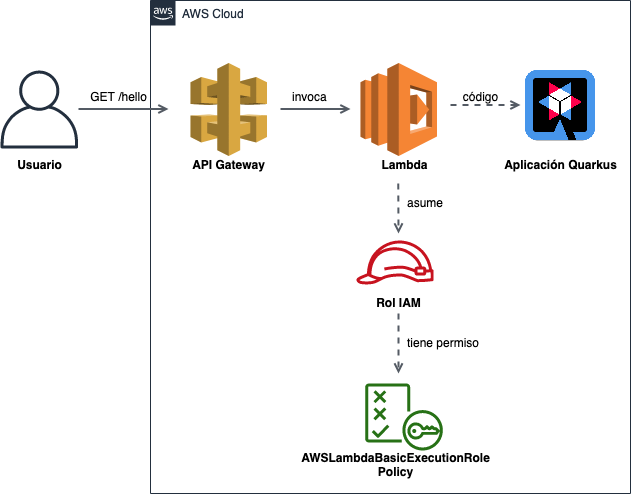

## Contenido
1. [Antes de empezar](#1-antes-de-empezar)
2. [Crear el proyecto](#2-crear-el-proyecto)
3. [Examinando el proyecto](#3-examinando-el-proyecto)
4. [Compilar el proyecto](#4-compilar-el-proyecto)
5. [Testear en local](#5-testear-en-local)
6. [Deploy](#6-deploy)
7. [Testear la lambda en el stack](#7-testear-la-lambda-en-el-stack)
8. [Links](#8-links)


## 1. Antes de empezar
* Recuerda instalar y configurar los [requerimientos](../README.md#requerimientos-previos).
* Es recomendable (pero no obligatorio) realizar la [guía para deployar una función lambda sin SAM](../simple-lambda/simple-lambda.md). Solo es necesario entenderla, pues el proceso es muy similar.
* Esta guía asume que haz leído [qué es SAM](../cloudformation.md#sam-cli).

## 2. Crear el proyecto
Generar proyecto de Quarkus con el siguiente comando. Usaremos la extensión `quarkus-amazon-lambda-http` (tiene un `-http` a diferencia de la usada en la [guía sin sam](../simple-lambda/simple-lambda.md)).

Pedirá un group id y artifact id, este último será el nombre de la carpeta creada.

Para Windows, reemplazar los `\` con `^`.
```bash
mvn archetype:generate \
       -DarchetypeGroupId=io.quarkus \
       -DarchetypeArtifactId=quarkus-amazon-lambda-http-archetype \
       -DarchetypeVersion=1.6.1.Final
```

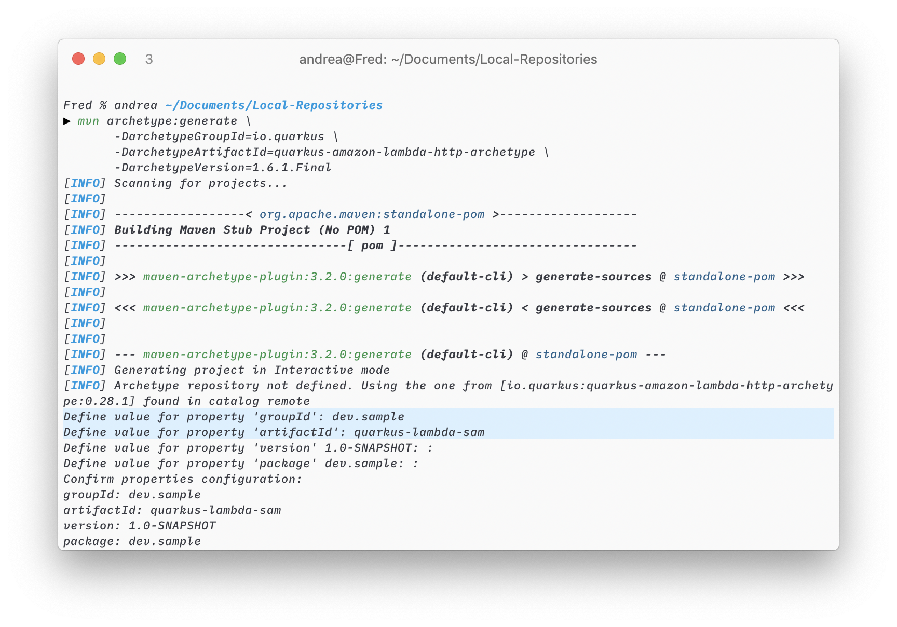

> Nota: También puede hacerse desde https://code.quarkus.io/ seleccionando AWS Lambda HTTP.
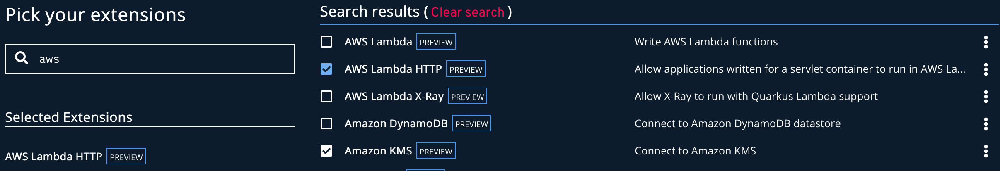

## 3. Examinando el proyecto
El proyecto generado contiene una aplicación web simple con cuatro endpoints. Cada uno de estos endpoints ha sido construido con herramientas distintas para ejemplificar cómo podemos usarlas. Dentro de `src/main/java/{groupId}` encontramos las clases `GreetingFunction`, `GreetingResource`, `GreetingServlet` y `GreetingVertx` que los implementan.

Herramienta        | Endpoint             | Clase
-------------------| -------------------- | -------------------
RESTEasy (JAX-RS)  | `GET /hello`         | `GreetingResource`
Undertow (servlet) | `GET /servlet/hello` | `GreetingServlet`
Vert.x Web         | `GET /vertx/hello`   | `GreetingVertx`
Funqy HTTP         | `GET /funqyHello`    | `GreetingFunction`

Cada una de estas funciona independientemente, por lo que podemos elegir las herramientas que queramos para armar nuestro proyecto y descartar el resto. En esta ocasión trabajaremos solo con RESTEasy.

#### Diferencia de la lambda con otra aplicación de Quarkus
En general, el proyecto es igual a cualquier otra aplicación web de Quarkus. Entonces, **¿dónde aparece la funcionalidad de Amazon Lambda?**

En `pom.xml`, se encuentra la dependencia `quarkus-amazon-lambda-http`, justo debajo de `funqy-http` y `junit5`. Esta se encarga de generar los archivos necesarios para nuestra lambda al compilar la aplicación. Veremos estos archivos [luego](#examinando-los-archivos-generados).

```xml
// pom.xml

...

    <dependency>
        <groupId>io.quarkus</groupId>
        <artifactId>quarkus-amazon-lambda-http</artifactId>
    </dependency>

...
```

Además, puedes haber visto el archivo `zip.xml` en `src/assembly`. Este indica cómo empaquetar el ejecutable generado al compilar en modo nativo y es requerido por el plugin `maven-assembly-plugin`. Es referenciado en el `pom.xml`.


```xml
// pom.xml

  ...
                    <plugin>
                        <groupId>org.apache.maven.plugins</groupId>
                        <artifactId>maven-assembly-plugin</artifactId>
                        <version>3.1.0</version>
                        <executions>
                            <execution>
                                <id>zip-assembly</id>
                                <phase>package</phase>
                                <goals>
                                    <goal>single</goal>
                                </goals>
                                <configuration>
                                    <finalName>function</finalName>
                                    <descriptors>
                                        <descriptor>src/assembly/zip.xml</descriptor>
                                    </descriptors>
                                    <attach>false</attach>
                                    <appendAssemblyId>false</appendAssemblyId>
                                </configuration>
                            </execution>
                        </executions>
                    </plugin>
  ...
```


### Descartando las extensiones innecesarias
1. Eliminamos los archivos `GreetingFunction.java`, `GreetingServlet.java` y `GreetingVertx.java`, dejando solo `GreetingResource.java`.
2. En `pom.xml` eliminamos las dependencias de `undertow`, `vertx-web` y `funqy-http` que no usaremos. Como notarás, Quarkus incluso nos indica cuales son.
```xml
// pom.xml

    ...

    <dependencies>
        <!-- remove if not using jaxrs -->
        <dependency>
            <groupId>io.quarkus</groupId>
            <artifactId>quarkus-resteasy</artifactId>
        </dependency>
        <!-- remove if not using servlets -->
        <dependency>
            <groupId>io.quarkus</groupId>
            <artifactId>quarkus-undertow</artifactId>
        </dependency>
        <!-- remove if not using vertx web -->
        <dependency>
            <groupId>io.quarkus</groupId>
            <artifactId>quarkus-vertx-web</artifactId>
        </dependency>
        <!-- remove if not using funqy -->
        <dependency>
            <groupId>io.quarkus</groupId>
            <artifactId>quarkus-funqy-http</artifactId>
        </dependency>

    ...
```
3. Por último vamos a `src/test/java/{groupId}` y vemos que tenemos un test para cada endpoint en `GreetingTest.java`. Eliminamos los innecesarios y nuestro archivo queda así...

```java
// GreetingTest.java

// ... imports ...

@QuarkusTest
public class GreetingTest
{
    @Test
    public void testJaxrs() {
        RestAssured.when().get("/hello").then()
                .contentType("text/plain")
                .body(equalTo("hello jaxrs"));
    }
}

```

> Nota: Los tests están hechos con `junit`, como en cualquier otro proyecto de Quarkus.

## 4. Compilar el proyecto
Al igual que en el proyecto sin SAM, para compilar el proyecto:
```bash
cd quarkus-lambda-sam
mvn clean package
```

Si se desea compilarlo en modo nativo (demora más):
```bash
# Linux
mvn package -Pnative
# Non-linux (con docker)
mvn clean install -Pnative -Dnative-image.docker-build=true
```

### Examinando los archivos generados
Además de nuestras clases compiladas, la dependencia `quarkus-amazon-lambda-http` genera archivos necesarios para deployar nuestro proyecto.

Podemos comentar la dependencia, compilar el proyecto (correr `mvn clean install` para compilarlo) y ver las diferencias de los archivos generados. Si haces esto recuerda descomentarlo después.

Sin la dependencia:
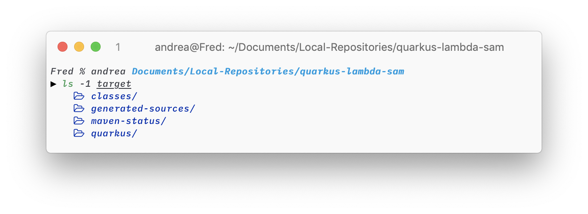

Con la dependencia:
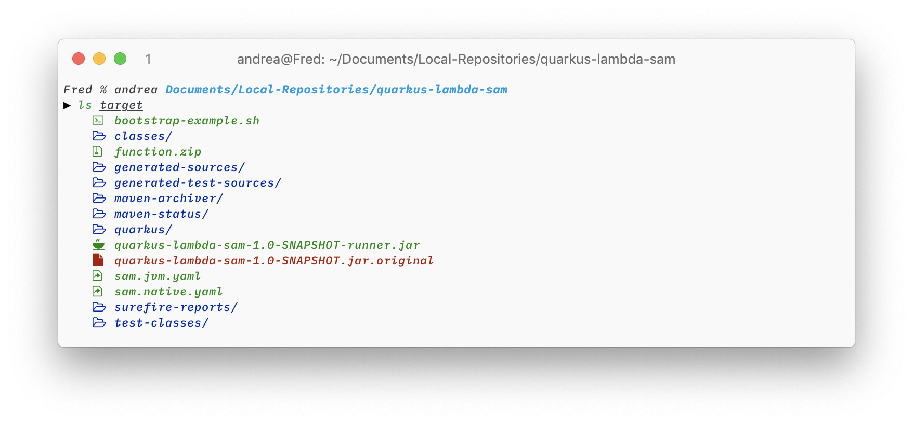

Los archivos más importantes son los YAML y `function.zip`. Como vimos en la [guía de lambda sin SAM](../simple-lambda/simple-lambda.md), `function.zip` empaqueta el código de nuestra aplicación, lista para ser deployada. `sam.jvm.yalm` (y `sam.native.yml` para el modo nativo) es el template que usará SAM CLI para construir nuestra aplicación con CloudFormation (para qué es esto, click [aquí](../cloudformation.md#sam-cli)).

### Examinando `sam.jvm.yalm`
`sam.jvm.yalm` está compuesto por cuatro partes principales:

#### Declaraciones iniciales
Aquí se declara la versión del template y que debe ser tratado bajo el modelo de aplicación serverless. Además, una pequeña descripción de para qué sirve el template.
```yaml
  AWSTemplateFormatVersion: '2010-09-09'
  Transform: AWS::Serverless-2016-10-31
  Description: AWS Serverless Quarkus HTTP - quarkus-lambda-sam-1.0-SNAPSHOT
```

####  Configuración global
Este sección define la configuración que se utilizará para todos los recursos que se definan luego. Si tus recursos no requieren ninguna configuración, puedes eliminar esta parte. Quarkus la utiliza para configurar la API y codificar los HTTP responses en binario (base 64). Más info [aquí](https://quarkus.io/guides/amazon-lambda-http#examine-sam-yaml).
```yaml
# sam.jvm.yalm

...

Globals:
    Api:
      EndpointConfiguration: REGIONAL
      BinaryMediaTypes:
        - "*/*"

...
```
#### Recursos
Esta es la parte más importante en un template. Define los recursos que CloudFormation utilizará para construir tu infraestructura. Puede contener S3 buckets, EC2 instances, funciones lambdas, etc.. En este proyecto, el único recurso que tenemos definido es la función lambda. 

Primero se declara el tipo de recurso con `Type: AWS::Serverless::Function`. 

Luego se configura nuestra lambda a través de `Properties`. Si algunas de estas propiedades te resultan conocidas es porque son las mismas opciones que utilizamos al crear nuestra lambda con `aws lambda create-function` en [esta sección](../simple-lambda/simple-lambda.md#qu%C3%A9-hace-el-script) de la guía sin SAM.
Además, tenemos la propiedad de `Policies` que dará permisos básicos a nuestra lambda (acceso de escritura a los logs en `CloudWatch`). Esta vez no tendremos que crear un rol y asignarle un policy manualmente, CloudFormation hará esto por nosotros.

Por último se indica cual será el evento que activará nuestra lambda, en este proyecto es una API con cualquier endpoint (excepto `/`) y cualquier método. Los endpoints y métodos los manejará nuestra aplicación de Quarkus, que por ahora cuenta con `/hello`. Tampoco tendremos que crear el API Gateway manualmente, CloudFormation también lo creará automáticamente.

> Nota: Si quisieramos, podríamos modificar el `Path` para que nuestra aplicación esté disponible solo en este prefijo. Por ejemplo, si cambiáramos `/{proxy+}` por `/quarkus`, para poder acceder al endpoint declarado en nuestra aplicación ahora tendríamos que ir a `/quarkus/hello`.

```yaml
# sam.jvm.yalm

...

QuarkusLambdaSam:
      Type: AWS::Serverless::Function
      Properties:
        Handler: io.quarkus.amazon.lambda.runtime.QuarkusStreamHandler::handleRequest
        Runtime: java11
        CodeUri: function.zip
        MemorySize: 512
        Policies: AWSLambdaBasicExecutionRole
        Timeout: 15
        Events:
          GetResource:
            Type: Api
            Properties:
              Path: /{proxy+}
              Method: any
...
```

#### Outputs
Los outputs son opcionales y en este proyecto no son indispensables, pero pueden servirnos para poder visualizar ciertos valores en la interfaz de CloudFormation como la url de nuestro API. La verdadera utilidad de los Outputs se encuentra cuando queremos exportar ciertos valores de nuestro stack (término de CloudFormation. Leer [esto](../cloudformation.md#sam-cli)) e importarlos en otro. Así podemos referenciar recursos a través de stacks.

```yaml
  Outputs:
    QuarkusLambdaSamApi:
      Description: URL for application
      Value: !Sub 'https://${ServerlessRestApi}.execute-api.${AWS::Region}.amazonaws.com/Prod/'
      Export:
        Name: QuarkusLambdaSamApi
```

## 5. Testear en local
Para probar nuestra lambda localmente usaremos el SAM CLI, que utiliza Docker para recrear la infraestructura de nuestra aplicación definida en `sam.jvm.yaml` y que tendremos en AWS una vez deployada. Recuerda tener Docker corriendo en segundo plano. 

```bash
# Para modo nativo usar target/sam.native.yaml
sam local start-api --template target/sam.jvm.yaml
```

Esto simulará el API Gateway y la función lambda. Podemos acceder a http://127.0.0.1:3000/hello y recibiremos un `"hello jaxrs"`.

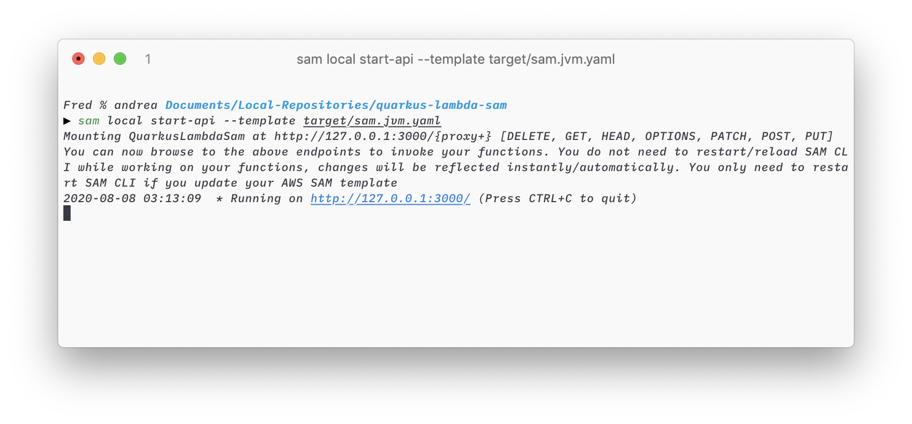
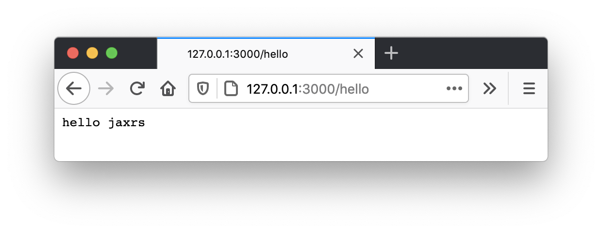

> Nota: Podemos también correr la aplicación como cualquier otra con Quarkus con `mvn compile quarkus:dev` y obtener el mismo resultado accediendo a http://127.0.0.1:8080/hello. Sin embargo, aquí estamos probando la aplicación, no la función lambda. `sam local` simula el ambiente en que correrá la lambda en AWS, por lo que la usamos en cambio.

## 6. Deploy

### Enviar artifacts a S3
Para deployar nuestra lambda junto con nuestro Amazon API Gateway y los permisos necesarios, tal y como se indica en nuestro template, primero se empaca nuestra aplicación compilada y se manda a un S3 bucket. A estos archivos empaquetados,  los llamamos **artifacts**.
Tal vez recuerdas cuando [deployamos una lambda con la interfaz de Amazon](../simple-lambda/simple-lambda.md#62-en-la-interfaz-web-de-amazon): subimos `function.zip` como código de nuestra lambda, este sería el artifact que ahora estaría en un S3 bucket.

> **¿S3 bucket?:** S3 es un servicio de almacenamiento de Amazon que guarda archivos en "buckets", similares a carpetas.

Para empaquetar nuestra aplicación y enviarla a S3, primero tenemos que crear un bucket en S3 y anotar su nombre.

Vamos a la [interfaz de Amazon S3](https://s3.console.aws.amazon.com/s3/home) y hacemos click en Create Bucket. Ingresa cualquier nombre para el bucket y cualquier región. Recuerda que la región que selecciones debe ser la misma para todo el resto del proyecto, de preferencia usa la región por default que configuraste en `aws configure`. Para los siguientes pasos deja la configuración por default.

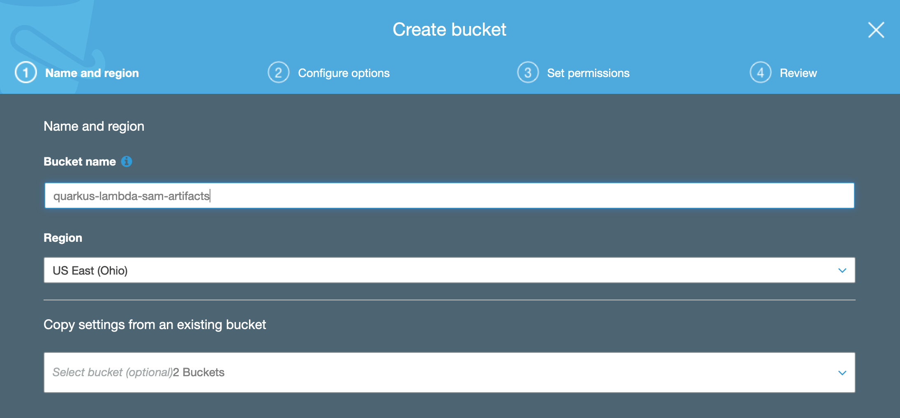

Luego de crearlo, tu bucket aparece en la lista de S3 buckets.
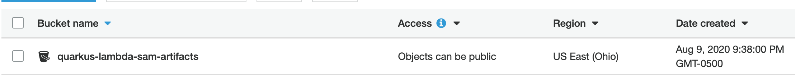

Ahora usa el siguiente comando para enviar el artifact a tu bucket. Además, creará una copia de nuestro `sam.jvm.yaml` pero con una línea diferente con un `CodeUri`, indicando la dirección del bucket donde se encuentra nuestro artifact en S3. Este nuevo template será el que usaremos para el deploy, utilizamos `--output-template-file` para especificar cómo se llamará.

```bash
sam package --template-file target/sam.jvm.yaml --s3-bucket quarkus-lambda-sam-artifacts --output-template-file out.yaml
```

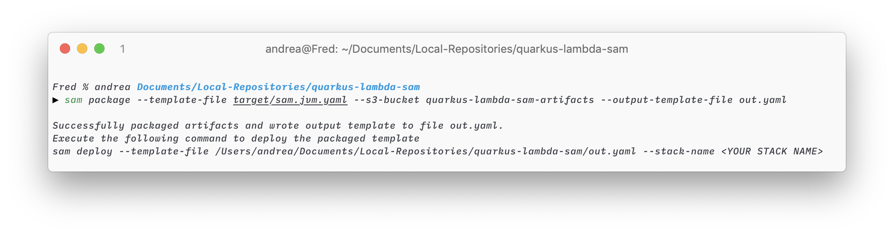

`sam package` ha enviado nuestro artifact a S3 y ha creado `out.yalm`.

```yaml
# out.yaml

...

Resources:
  QuarkusLambdaSam:
    Type: AWS::Serverless::Function
    Properties:
      ...
      CodeUri: s3://quarkus-lambda-sam-artifacts/91c94796bc0cf5780d9f5403e2b0ca72
      ...
...
```

En la interfaz de S3 vemos que aparece un nuevo archivo en nuestro bucket.

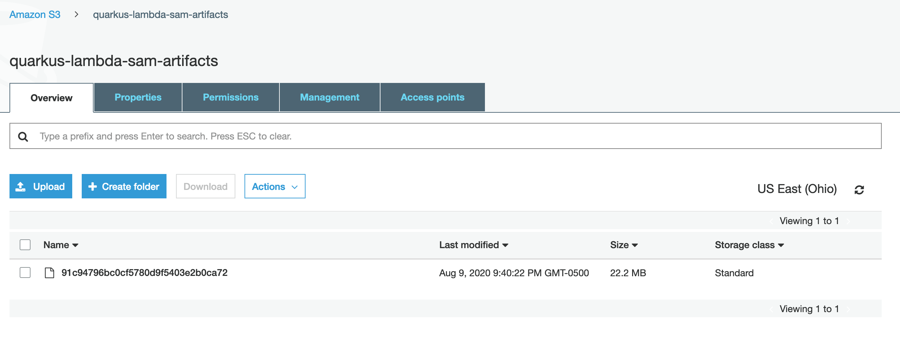

### Deployar
Para finalmente deployar nuestro proyecto y convertir la infraestructura del template a realidad, utilizamos el siguiente comando. Dale un nombre cualquiera al stack que se creará para contener tus recursos. Ya que crearemos a un nuevo rol para nuestra lambda y modificaremos los permisos de nuestra cuenta de AWS tenemos que especificar `--capabilities CAPABILITY_IAM` (IAM es AWS Identity and Access Management).

```bash
sam deploy --template-file out.yaml --capabilities CAPABILITY_IAM --stack-name quarkus-lambda-sam
```

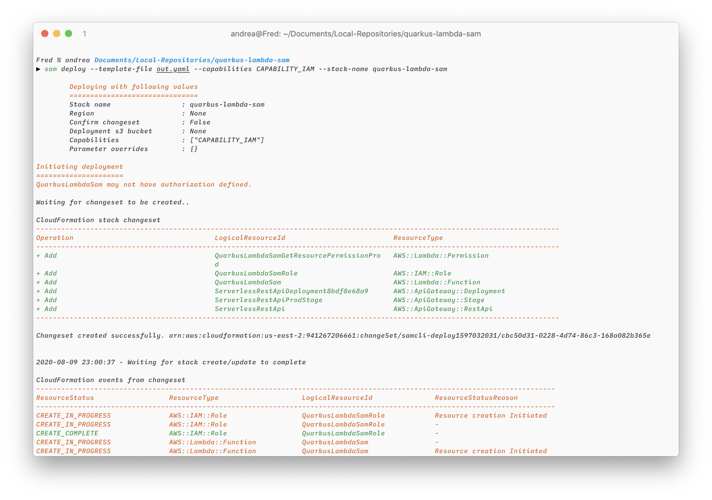

#### Changeset
Una de las palabras que encontraremos en el output es **changeset**. En CloudFormation, un changeset es, como lo dice su nombre, un conjunto de cambios que se aplicarán al stack durante el deployment. El stack luego es creado o actualizado en base a los cambios.

### Método simplificado
En la última versión del SAM CLI, el método que utilizamos anteriormente ha sido reemplazado por uno mucho más simple. Ahora no es necesario crear un S3 bucket manualmente o utilizar `sam package` para enviar nuestro artifact a S3.

Simplemente usamos
```bash
sam deploy --template-file target/sam.jvm.yaml --guided
```

Nos preguntará el nombre que queremos darle al stack , la región (`--region us-east-2`) y nos pedirá permiso para crear el rol en IAM. En el método anterior hicimos esto con `--stack-name`, la región la pudimos haber configurado con `--region` (como no lo hicimos obtuvo el default de `aws configure`) y `--capabilities CAPABILITY_IAM`. También pregunta si queremos guardar los argumentos a un `samconfig.toml`, aceptemos, lo explicaremos luego.

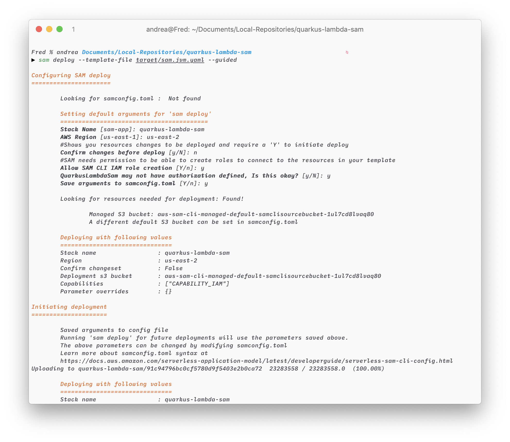

Eso es todo. El S3 bucket es creado automáticamente por el SAM CLI en la misma región que el stack, el artifact ha sido mandado ahí y nuestro proyecto ha sido deployado. Un archivo adicional ha sido creado en la misma dirección que el template (en `target/`): `samconfig.toml`. Este pequeño archivo guarda las opciones que respondimos durante el deployment y nos muestra el S3 bucket y prefix (el prefix es una carpeta dentro del bucket) a donde se subió nuestro archivo. Por default, SAM CLI siempre utilizará el mismo bucket para todos los stacks y creará un prefix con el nombre del stack dentro del bucket. Si queremos cambiar el bucket o el prefix podemos modificar el `samconfig.toml`. La próxima vez que queramos deployar nuestro proyecto solo debemos hacer `sam deploy --template-file target/sam.jvm.yaml`, las opciones serán obtenidas del `samconfig.toml`.

```
# samconfig.toml

version = 0.1
[default]
[default.deploy]
[default.deploy.parameters]
stack_name = "quarkus-lambda-sam"
s3_bucket = "aws-sam-cli-managed-default-samclisourcebucket-1ul7cd8lvaq80"
s3_prefix = "quarkus-lambda-sam"
region = "us-east-2"
capabilities = "CAPABILITY_IAM"

```

## 7. Testear la lambda en el stack
En la [interfaz de CloudFormation](https://us-east-2.console.aws.amazon.com/cloudformation/home), seleccionamos Stacks en el menú de la izquierda. En la lista de stacks vemos el que acabamos de crear.

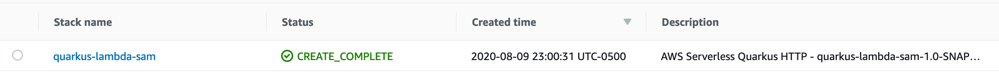

Para obtener el URL de nuestra API, hacemos click al stack y vamos a la pestaña de Outputs. Aquí encontraremos el valor que se encontraba definido en el template.

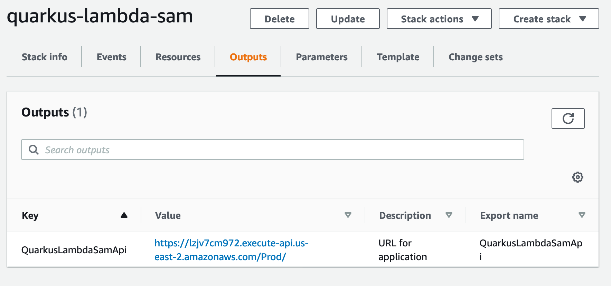

Si vamos al endpoint `/` recibimos un mensaje de `{"message":"Missing Authentication Token"}`. Este es el mensaje que nos devuelve el API Gateway cuando no encuentra un recurso y es completamente esperado, pues nuestra aplicación se llama ante cualquier endpoint excepto `/`. 

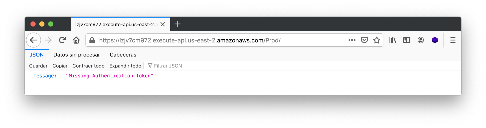

Si ponemos cualquier otro endpoint, como `/a`, recibimos un error de RESTEASY, la herramienta que usamos en nuestra aplicación de Quarkus. Ello significa que se ha invocado a nuestra lambda.

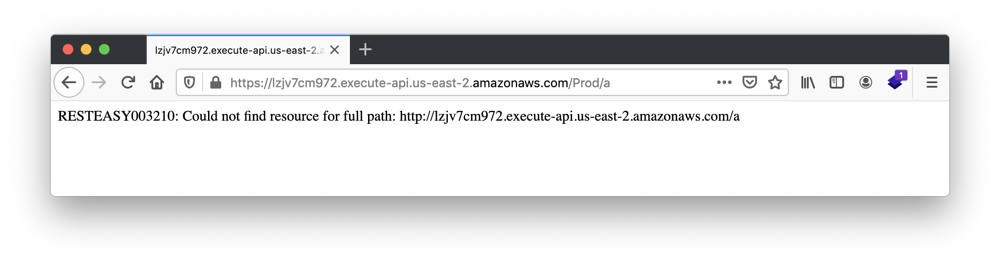

Finalmente, usamos el endpoint correcto `/hello` que, como probamos en local, nos devolverá `hello jaxrs`.

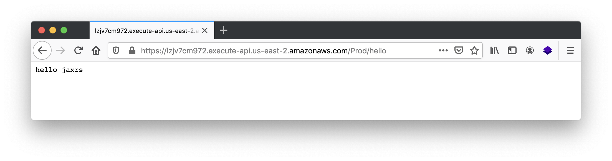

Eso es todo :smile:.

Podemos jugar con nuestra aplicación de Quarkus y agregarle más endpoints o hacer que devuelva un JSON en lugar de un String y deployarlo.

En la próxima guía agregaremos un pipeline a este proyecto para automatizar nuestros deployments cada vez que pusheemos en un repositorio remoto.

## 8. Links
* https://quarkus.io/guides/amazon-lambda-http
* https://cicd.serverlessworkshops.io/sam/template.html
* https://aws.amazon.com/es/blogs/compute/a-simpler-deployment-experience-with-aws-sam-cli/

