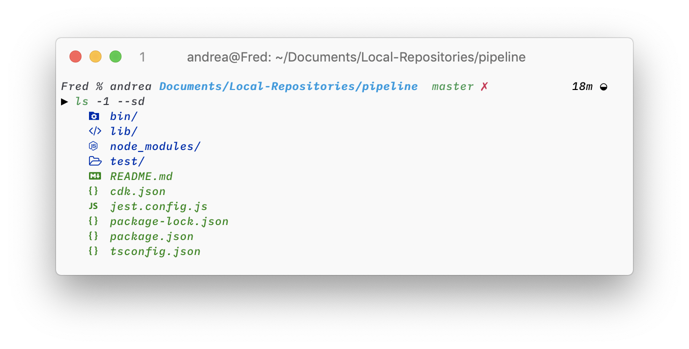
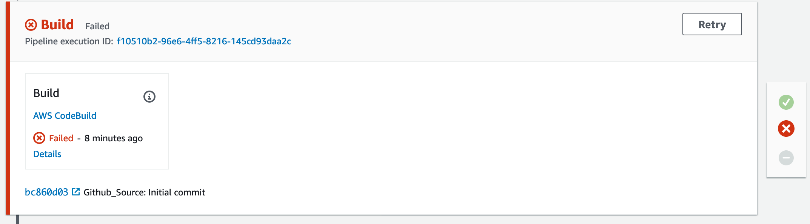

# Implementar el pipeline
## Objetivo
Implementar un pipeline mediante AWS CodePipeline para deployments automáticos cuando se actualiza un repositorio remoto.


## Contenido
1. [Antes de empezar](#1-antes-de-empezar)
2. [Crear el repositorio](#2-crear-el-repositorio)
3. [Crear el pipeline](#3-crear-el-pipeline)
4. [Examinando el proyecto](#4-examinando-el-proyecto)
5. [Crear un S3 bucket para los artifacts](#5-crear-un-S3-bucket-para-los-artifacts)
6. [Crear el pipeline](#6-crear-el-pipeline)
7. [Crear los stage del pipeline](#7-crear-los-stage-del-pipeline)
  7.1. [Source stage](#71-source-stage)
  7.2. [Build stage](#72-build-stage)
  7.3. [Deploy stage](#73-deploy-stage)
8. [Deployar el pipeline](#8-deployar-el-pipeline)
9. [Testear el pipeline](#9-testear-el-pipeline)
10. [Links](#10-links)

## 1. Antes de empezar
* Recuerda instalar y configurar los [requerimientos](../README.md#requerimientos-previos).
* Utilizaremos el proyecto que creamos en la [guía de lambda con API y SAM](../api-sam-lambda/api-sam-lambda.md), por lo que la debes haber seguido o al menos, tener el resultado final.
* Esta guía asume que haz leído [qué es Amazon CDK](../cloudformation.md#amazon-cdk).

## 2. Crear el repositorio
Vamos al proyecto que construímos en la [guía pasada](../api-sam-lambda/api-sam-lambda.md) e inicializamos el repositorio.

```bash
cd quarkus-lambda-sam
git init
```

Creamos un `.gitignore` para evitar pushear los elementos creados al compilar.
```bash
# .gitignore

## Build files ##
target
```

Añadimos los archivos al stage y commiteamos.
```
git add .
git commit -m "Initial commit"
```

En esta ocasión usaremos Github, por lo que creamos un repositorio remoto ahí y pusheamos nuestro repositorio local.

```bash
git remote add origin git@github.com:andrea-velasquez/quarkus-lambda-sam.git
git push -u origin master
```

## 3. Crear la aplicación para el pipeline
El pipeline es creado una aplicación distinta, separada de la que acabamos de crear, por lo que podemos crearla donde queramos. Para esta guía, la crearé fuera y a la misma altura que el repositorio con nuestro código de Quarkus.

Salimos de nuestro repositorio y creamos una carpeta para la aplicación que contendrá nuestro pipeline.
```bash
cd ..
mkdir pipeline
cd pipeline
```

Creamos un nuevo proyecto con [Amazon CDK](../cloudformation.md#amazon-cdk). Hay distintos lenguajes disponibles, pero usaremos `typescript`.
Para ver los otros lenguajes, puedes usar `cdk init app`


```bash
cdk init --language typescript
```


El proyecto creado por `cdk init` también inicializó un repositorio. Podemos ver que ya hizo un primer commit por nosotros.
```bash
git log # Mostrar los commits realizados
```

Además, instalamos módulos que utilizaremos luego
```
npm install --save @aws-cdk/aws-codedeploy
npm install --save @aws-cdk/aws-codebuild
npm install --save @aws-cdk/aws-codepipeline-actions
npm install --save @aws-cdk/aws-s3
```

## 4. Examinando el proyecto


### `cdk.json`
El key `app` contiene los comandos para que `cdk` sepa cómo correr la aplicación, pues es diferente para cada lenguaje. Mientras que `context` sirve para pasar variables que también serán usadas para correr la app.
```json
// cdk.json

{
  "app": "npx ts-node bin/pipeline.ts",
  "context": {
    "@aws-cdk/core:enableStackNameDuplicates": "true",
    "aws-cdk:enableDiffNoFail": "true"
  }
}
```

### Código del pipeline
Las carpetas `bin`, `lib` y `test` contienen el código principal para nuestra aplicación.

Todo empieza por `bin/pipeline.ts`, donde creamos nuestra app y colocamos en ella un nuevo Stack llamado `PipelineStack`.

```typescript
// bin/pipeline.ts
// imports...

const app = new cdk.App();
new PipelineStack(app, 'PipelineStack');
```

El código que define nuestro pipeline se encuentra en `lib/pipeline-stack.ts`. Podemos ver que extiende la clase `Stack`, que requiere un constructor con los parámetros de `scope` (donde será colocado el stack), un `id` (el nombre del stack) y, opcionalmente, los `props` (propiedades, un objeto del tipo `StackProps`).

Por ahora el código del stack esta vacío, pero iremos llenándolo. Puedes ver el código final de `pipeline-stack.ts` [aquí](pipeline-stack.ts).

```typescript
// lib/pipeline-stack.ts
// imports...

export class PipelineStack extends cdk.Stack {
  constructor(scope: cdk.Construct, id: string, props?: cdk.StackProps) {
    super(scope, id, props);

    // The code that defines your stack goes here
  }
}
```

Por último, los tests se encuentran en `test/pipeline.test.ts`. Tenemos un ejemplo de test que crea nuestro stack y comprueba que esté vacío.

```typescript
// test/pipeline.test.ts
// imports...

test('Empty Stack', () => {
    const app = new cdk.App();
    // WHEN
    const stack = new Pipeline.PipelineStack(app, 'MyTestStack');
    // THEN
    expectCDK(stack).to(matchTemplate({
      "Resources": {}
    }, MatchStyle.EXACT))
});
```

### Otros archivos
El resto de archivos, además del `README.md`, son propios de cada lenguaje para guardar las dependencias necesarias o configuraciones.


## 5. Crear un S3 bucket para los artifacts
Como vimos en la guía pasada, CloudFormation recupera los artifacts de un S3 bucket para crear nuestro proyecto en Amazon. Con SAM creábamos el bucket durante `sam deploy` o simplemente lo creábamos manualmente, ahora lo haremos con código gracias a CDK.

Agregamos la línea que creará nuestro bucket dentro del constructor de PipelineStack en `lib/pipeline-stack.ts`, justo debajo del comentario, e importamos `s3` de  `@aws-cdk/aws-s3`.

```typescript
// lib/pipeline-stack.ts
...
import s3 = require('@aws-cdk/aws-s3');
...

// The code that defines your stack goes here
// Crear un S3 Bucket
const artifactsBucket = new s3.Bucket(this, 'ArtifactsBucket');
```

Esto creará un S3 Bucket llamado `ArtifactsBucket` dentro de `this`, que refiere a nuestro `PipelineStack`.

## 6. Crear el pipeline
Hasta ahora solo hemos creado un stack con un S3 Bucket, pero este stack **no es un pipeline**. El pipeline es solo el recurso principal que tendrá nuestro stack, también tiene otros como el S3 Bucket que definimos arriba.

Todos los pipeline necesitan un S3 Bucket a donde subir y recuperar los artifacts. Importamos `codepipeline` de `@aws-cdk/aws-codepipeline` y creamos un pipeline llamado `Pipeline` en `this`, que utilizará `artifactsBucket` (el bucket que definimos anteriormente) para almacenar los artifacts que genere.

```typescript
// lib/pipeline-stack.ts
...
import codepipeline = require('@aws-cdk/aws-codepipeline');
...

// Crear el pipeline
const pipeline = new codepipeline.Pipeline(this, 'Pipeline', {
            artifactBucket: artifactsBucket
        });
```

## 7. Crear los stage del pipeline
### 7.1. Source stage
Los pipeline se componen de varios pasos llamados `stage`, que realizan una lista de `actions` (si quieres ver cuales son todos los posibles actions, click [aquí](https://docs.aws.amazon.com/cdk/api/latest/dotnet/api/Amazon.CDK.AWS.CodePipeline.Actions.Action.html)). El primer paso viene a ser el **source stage**, donde se realiza la acción de recuperar el código de nuestra aplicación desde un repositorio cada vez que se detecte un cambio.

Para añadir un stage al pipeline usamos `addStage`, que recibe el nombre del stage y una lista de acciones.

Llamaremos a nuestro stage `Source` y definiremos la acción `GitHubSourceAction` para detectar y obtener el código de nuestro repositorio. 

> Nota: Otros source actions permiten obtener data de BitBucket, CodeCommit, ECR o S3.

`GitHubSourceAction` recibe los detalles del repositorio (props) mediante el siguiente objeto...


```typescript
{
  actionName: 'Github_Source',
  owner: 'andrea-velasquez',
  repo: 'quarkus-lambda-sam',
  branch: 'master',
  oauthToken: <github-token>,
  output: <artifact>,
}
```

key | value |
----|-------|
`actionName` | Nombre de la acción. Puede tener un nombre cualquiera.
`owner` | El usuario del dueño del repositorio de Github. En este caso es tu usuario.
`repo` | Nombre del repositorio
`branch` | Branch que detectará la acción. Por default es `master`, por lo que podríamos no incluirla.
`oauthToken` | Token de Github que da permisos para acceder al repositorio.
`output` | El artifact que contendrá el código. Para poder usar el código en otro stage, lo tenemos que convertir en un artifact. 

#### Obtener un Github token
Vamos a la configuración de nuestra cuenta de Github > Developer settings > Personal access tokens o simplemente haz click [aquí](https://github.com/settings/tokens). Generamos un nuevo token con el scope repo. Copia el token y guárdalo en un lugar seguro, luego de salir de la página ya no podrás visualizar el token, tendrás que generarlo de nuevo.


Este token debe mantenerse secreto porque da permisos a todos tus repositorios en Github. Por ello, evitaremos ponerlo en el código y lo pasaremos mediante una variable (de entorno) llamada `GITHUB_TOKEN` cuando corramos el comando para deployar el pipeline. Para obtener esta variable, usaremos `process.env.GITHUB_TOKEN`.

Agregaremos un pequeño condicional por si nos olvidamos de pasar el token.
```typescript
if (!process.env.GITHUB_TOKEN) {
  console.log("Falta incluir un GITHUB_TOKEN");
}
```

#### Pasar el código a un artifact
Antes de crear el stage, creamos el artifact que contendrá el código.

```typescript
// Crear artifact para el código
const sourceArtifact = new codepipeline.Artifact();
```

#### Agregar el stage
Luego de crear el artifact y agregar el condicional, agregamos el stage. Recuerda importar `codepipeline_actions`.

El código para todo el source stage sería el siguiente.

```typescript
// lib/pipeline-stack.ts
...
import codepipeline_actions = require('@aws-cdk/aws-codepipeline-actions');
...

// Crear artifact para el código
const sourceArtifact = new codepipeline.Artifact();

if (!process.env.GITHUB_TOKEN) {
  console.log("Falta incluir un GITHUB_TOKEN");
}

// Agregar source stage
pipeline.addStage({
  stageName: 'Source',
  actions: [
    new codepipeline_actions.GitHubSourceAction({
    actionName: 'Github_Source',
    owner: 'andrea-velasquez',
    repo: 'quarkus-lambda-sam',
    branch: 'master',
    oauthToken: cdk.SecretValue.plainText(process.env.GITHUB_TOKEN!),
    output: sourceArtifact,
  }),
  ],
});
```

### 7.2. Build stage
Cuando intentabamos deployar manualmente nuestro proyecto con SAM CLI en la [guía pasada](../api-sam-lambda/api-sam-lambda.md), primero compilabamos el proyecto. Ya que ahora buscamos automatizar esto usaremos AWS CodeBuild (también podríamos usar otros servicios).

Primero creamos nuestro proyecto de CodeBuild. Especificamos la imagen que se usará (en este caso `AMAZON_LINUX_2_2`) y el bucket donde almacenará los artifacts (`artifactsBucket`, el bucket que creamos al principio). Recuerda que estamos pasando la variable `PACKAGE_BUCKET` con el valor `artifactsBucket`, la veremos después.
```typescript
// lib/pipeline-stack.ts
...
import codebuild = require('@aws-cdk/aws-codebuild');
...

// Crear proyecto de CodeBuild
const buildProject = new codebuild.PipelineProject(this, 'Build', {
  environment: { buildImage: codebuild.LinuxBuildImage.AMAZON_LINUX_2_2 },
  environmentVariables: {
    'PACKAGE_BUCKET': {
      value: artifactsBucket.bucketName
    }
  }
});
```

Nuevamente tenemos que crear un artifact para nuestro proyecto compilado.

```typescript
// lib/pipeline-stack.ts
...

// Crear artifact para el proyecto compilado
const buildArtifact = new codepipeline.Artifact();
```

Y añadimos el **build stage**. Incluimos una acción `CodeBuildAction` llamada `Build` que utiliza el proyecto de CodeBuild `buildProject`, recibe el código como artifact `sourceArtifact` y pasa el artifact final a `buildArtifact`. ¿Por qué `outputs` recibe una lista de artifacts y no solo uno? ¿De dónde sale este artifact? Se responderá después.
```typescript
// lib/pipeline-stack.ts

...

// Agregar build stage
pipeline.addStage({
  stageName: 'Build',
  actions: [
    new codepipeline_actions.CodeBuildAction({
      actionName: 'Build',
      project: buildProject,
      input: sourceArtifact,
      outputs: [buildArtifact],
    }),
  ],
});
```

#### Especificar cómo compilar el proyecto
¿Qué hace CodeBuild para saber cómo compilar el proyecto? Esto no sucede mágicamente, el proyecto tiene que tener un archivo `buildspec.yml` especificando cómo compilarlo.

Vamos a nuestros proyecto de Quarkus, el que subimos al repositorio de Github, y creamos un nuevo archivo `buildspec.yaml`.

```yaml
# quarkus-lambda-sam/buildspec.yaml

version: 0.2
phases:
  install:
    runtime-versions:
      java: corretto11

  build:
    commands:
        - mvn clean package

  post_build:
      commands:
        # Use Post-Build for notifications, git tags, upload artifacts to S3
        - sam package --template-file target/sam.jvm.yaml --s3-bucket $PACKAGE_BUCKET --output-template-file out.yaml
artifacts:
  files:
    - out.yaml
```

##### Examinando `buildspec.yaml`
La primera parte es `phases`, donde se definen los comandos utilizados para compilar el proyecto y el runtime. Estos se dividen en fases.

* En la fase `install` definimos el runtime que usaremos. La versión varía de acuerdo al ambiente que hayamos definido para CodeBuild, en Amazon Linux `Java JDK 11` es `corretto11`. Para otros ambientes o runtimes, ver la [documentación](https://docs.aws.amazon.com/codebuild/latest/userguide/build-spec-ref.html#build-spec.phases.install.runtime-versions). Aquí también podemos incluir `commands`, ya que a veces necesitamos instalar dependencias antes de compilar (`npm install` o `pip3 install` por ejemplo). En este caso omitimos los comandos porque no necesitamos ninguno.

* En la fase `build` utilizamos el comando `mvn clean package` que, como se mencionó en la [guía pasada](../api-sam-lambda/api-sam-lambda.md), genera el template `sam.jvm.yaml` en `target/`.

* Por último, en la fase `post_build` subimos nuestro artifact al bucket `$PACKAGE_BUCKET`. Esta es la variable a la que pasamos el bucket `artifactsBucket` en el pipeline (en `lib/pipeline-stack.ts`). Nota que nuestro template final (con la dirección del artifact en el S3 bucket) se llama `out.yaml`.

Existen más fases, pero no las utilizaremos. Si quieres ver cuales son, puedes ir a la [documentación](https://docs.aws.amazon.com/codebuild/latest/userguide/build-spec-ref.html#build-spec.phases).

```yaml
# quarkus-lambda-sam/buildspec.yaml
...
phases:
  install:
    runtime-versions:
      java: corretto11

  build:
    commands:
        - mvn clean package

  post_build:
      commands:
        - sam package --template-file target/sam.jvm.yaml --s3-bucket $PACKAGE_BUCKET --output-template-file out.yaml
...
```

La segunda parte es `artifacts`. Aquí se definen los artifacts que tendrá como output nuestro proyecto de CodeBuild. En el pipeline recibimos estos en el prop `outputs` de `CodeBuildAction`. Podemos tener varios artifacts como output, es por eso que el prop `output` es una lista. 

Nota que el artifact final no contiene el proyecto compilado, ningún `jar` o `zip`, sino nuestro template `out.yaml` con la dirección del artifact del proyecto compilado.
```yaml
# buildspec.yaml
...

artifacts:
  files:
    - out.yaml
```

### 7.3. Deploy stage
Finalmente, el último stage del pipeline es el **deploy stage**. Aquí creamos el ChangeSet y actualizamos (o creamos) nuestro stack. Si no recuerdas qué es el changeset, click [aquí](../api-sam-lambda/api-sam-lambda.md#changeset).

En este stage tenemos dos acciones `CloudFormationCreateReplaceChangeSetAction` y `CloudFormationExecuteChangeSetAction`.

#### `CreateReplaceChangeSet`
En esta acción creamos el changeset `quarkus-lambda-sam-changeset` para el stack `quarkus-lambda-sam` utilizando el template `out.yaml` del artifact `buildArtifact` que obtuvimos como resultado final del proyecto de CodeBuild (y que a su vez obtuvimos de `sam package`). `quarkus-lambda-sam` es el stack que creamos en la [guía pasada](../api-sam-lambda/api-sam-lambda.md) al deployar el proyecto manualmente, si cambiamos el nombre a un stack que no existe se creará uno nuevo.

#### `ExecuteChangeSetAction`
Luego de crear el changeset, deployaremos nuestro proyecto y actualizaremos (o crearemos) el stack.

```typescript
// lib/pipeline-stack.ts
...

// Agregar deploy stage
pipeline.addStage({
  stageName: 'Deploy',
  actions: [
    new codepipeline_actions.CloudFormationCreateReplaceChangeSetAction({
      actionName: 'CreateChangeSet',
      templatePath: buildArtifact.atPath("out.yaml"),
      stackName: 'quarkus-lambda-sam',
      adminPermissions: true,
      changeSetName: 'quarkus-lambda-sam-changeset',
      runOrder: 1
    }),
    new codepipeline_actions.CloudFormationExecuteChangeSetAction({
      actionName: 'Deploy',
      stackName: 'quarkus-lambda-sam',
      changeSetName: 'quarkus-lambda-sam-changeset',
      runOrder: 2
    }),
  ],
});
```

## 8. Deployar el pipeline
Ahora que ya implementamos el pipeline es hora de deployarlo. Para ello, compilaremos la aplicación de typescript con `npm` y deployaremos con `cdk`.

Recuerda utilizar el token de Github que obtuvimos en el [paso 7.1](#obtener-un-github-token).

```bash
npm run build
GITHUB_TOKEN=<TU_TOKEN> cdk deploy
```

Si ocurre algún error durante el build, verifica que la versión de todas las dependencias sea la misma. Si este no es el caso, cambia la versión y corre `npm install` para actualizar los cambios.

```json
// package.json
...
  "dependencies": {
    "@aws-cdk/aws-codebuild": "^1.57.0",
    "@aws-cdk/aws-codedeploy": "^1.57.0",
    "@aws-cdk/aws-codepipeline-actions": "^1.57.0",
    "@aws-cdk/aws-s3": "^1.57.0",
    "@aws-cdk/core": "1.57.0",
    "source-map-support": "^0.5.17"
  }
```


## 9. Testear el pipeline
En la [interfaz de CloudFormation](https://us-east-2.console.aws.amazon.com/cloudformation/home), seleccionamos Stacks en el menú de la izquierda y en la lista de stacks vemos el stack del pipeline que acabamos de crear.


Si vamos a [CodePipeline](https://us-east-2.console.aws.amazon.com/codesuite/codepipeline/pipelines) vemos nuestro pipeline, pero aparece como `Failed`.


Si entramos para ver más detalles, vemos que ha fallado en el build. Esto sucede porque no hemos aun no hemos commiteado nuestra último cambio en el proyecto de Quarkus, la que incluye el `buildspec.yaml`.



Añadimos y subimos nuestros cambios al repositorio remoto. Mantén abierta la ventana de la interfaz del pipeline en AWS, pues al pushear se activará el pipeline y comenzará a procesar de nuevo.
```bash
git add .
git commit -m "Add buildspec"
git push
```


El nombre del último commit aparece


Y finalmente se ha deployado.


Y eso es todo :partying_face:.

Puedes probar cambiando el response de la aplicación de Quarkus por `"Hola. Estoy deployando con un pipeline."` o cualquier cosa diferente a `"hello jaxrs"` y verás como el pipeline detecta el cambio y hace un deploy automático.

Si te perdiste puedes ver el código final de `pipeline-stack.ts` [aquí](pipeline-stack.ts).


## 10. Links
* https://cicd.serverlessworkshops.io/buildpipe.html
* https://medium.com/swlh/github-codepipeline-with-aws-cdk-and-typescript-d37183463302
* https://docs.aws.amazon.com/cdk/api/latest/dotnet/api/Amazon.CDK.AWS.CodePipeline.Actions.html
* https://docs.aws.amazon.com/codebuild/latest/userguide/build-spec-ref.html


